# Neural Network Charity Analysis

## **Overview of the analysis:** 

Explain the purpose of this analysis.

## **Results:** 

Using bulleted lists and images to support your answers, address the following questions.

Data Preprocessing

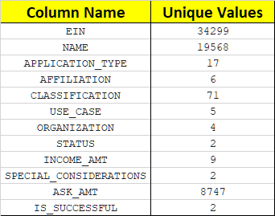

***Table 1 - All Data Set Columns***

- What variable(s) are considered the target(s) for your model?

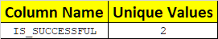

***Table 2 - Data Set Column used as Target***

- What variable(s) are considered to be the features for your model?

  

  

  ***Table 3 - Data Set Object Columns***

  

- What variable(s) are neither targets nor features, and should be removed from the input data?

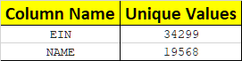

***Table 4 - Dropped Columns***

Compiling, Training, and Evaluating the Model
- How many neurons, layers, and activation functions did you select for your neural network model, and why?
- Were you able to achieve the target model performance?

***Table 5 - Initial Neural Network Model Summary***

***Table 6 - Initial Neural Network Performance***

What steps did you take to try and increase model performance?

### Attempt #1 - More Nodes and Layers

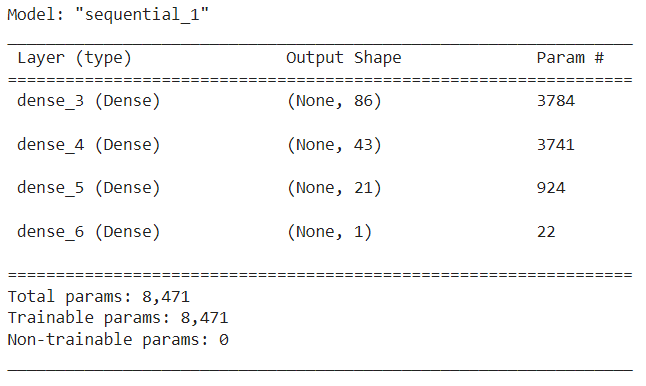

***Table 7 - More Nodes & Layers Neural Network Model Summary***

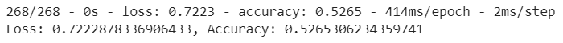

***Table 8 - More Nodes & Layers Neural Network Performance***

### Attempt #2 - Remove Noisy Variables

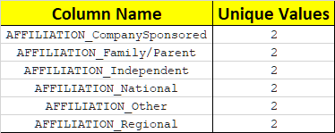

***Table 9 - Affiliation Columns Dropped***

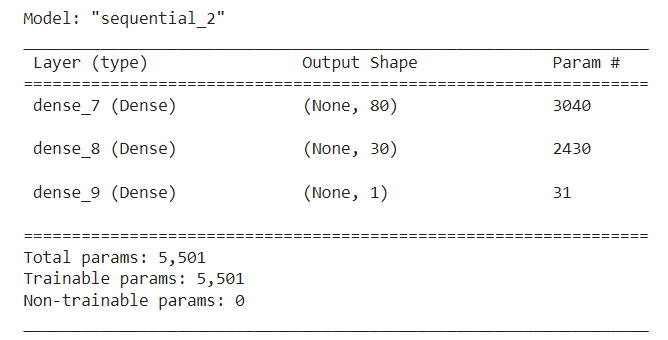

***Table 10 - Remove Affiliation Neural Network Model Summary***

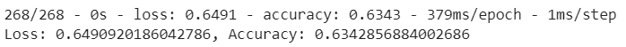

***Table 11 - Remove Affiliation Neural Network Model Performance***

### Attempt #3 - Change Activation Function

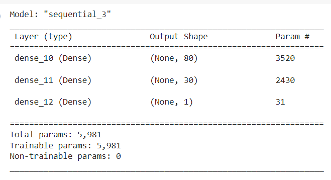

***Table 12 - Change Activation Neural Network Model Summary***

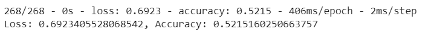

***Table 13 - Change Activation Neural Network Model Performance***

### Attempt #4 - Remove Different Noisy Variables

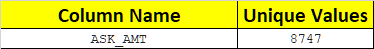

***Table 14 - Ask Amount Column Dropped***

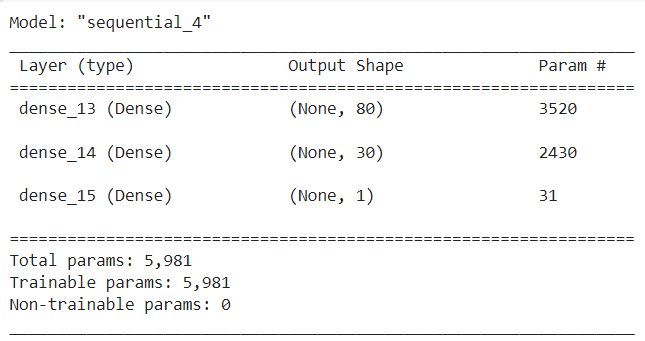

***Table 15 - Remove Ask Network Model Summary***

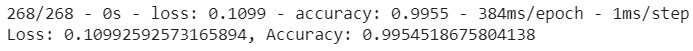

***Table 16 - Remove Ask Network Model Performance***

## **Summary:** 

Summarize the overall results of the deep learning model. Include a recommendation for how a different model could solve this classification problem, and explain your recommendation.

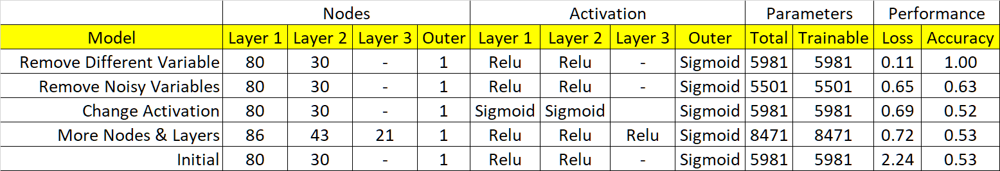

***Table 17 - Summary of Results***