# Neural Network Charity Analysis

## 1 **Overview of the analysis** 

The purpose of this works was to create a binary classifier that is capable of predicting whether applicants will be successful if funded by Alphabet Soup.  

## 2 Results 

The initial set up was followed and an evaluation of the performance was completed for that model.  Four more attempts were made by changing the model until a successful result was achieved.

### 2.1 Data Preprocessing

The original data set included all of the columns show in Table 1.

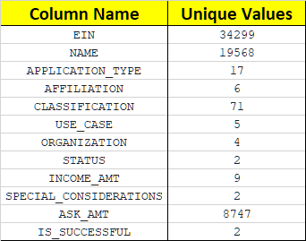

***Table 1 - All Data Set Columns***

The IS_SUCCESSFUL variable was considered the target for our model.

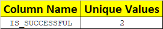

***Table 2 - Data Set Column used as Target***

The data set included a number of objects with multiple values as seen in table Table 3A.

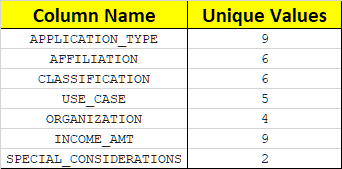

***Table 3A - Data Set Object Columns***

The objects were encoded using OneHotEncoder and added back to the other columns to create the large set of features in Table 3B.

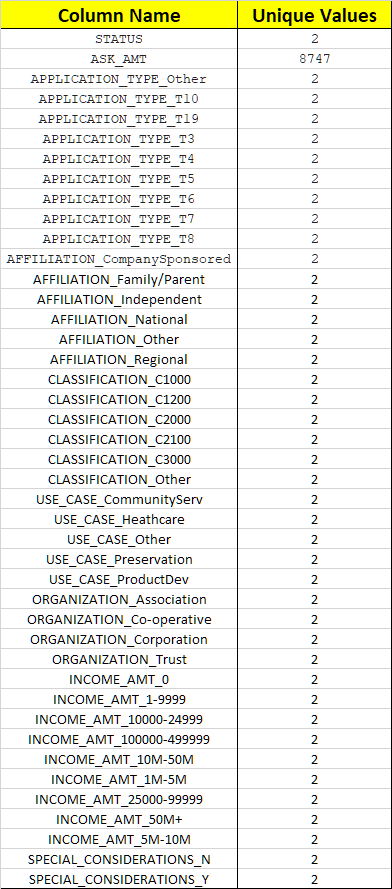

***Table 3B - Resulting Feature Columns***

Columns EIN and NAME variables are neither targets nor features, and were removed from the input data.

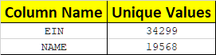

***Table 4 - Dropped Columns***

### 2.2 Compiling, Training, and Evaluating the Model

A number of models were made and run in the following sections.

- 2.2.1 Initial Setup with Provided Nodes, Layers and Activations
- 2.2.2 Attempt #1 - More Nodes and Layers
- 2.2.3 Attempt #2 - Remove Noisy Variables
- 2.2.4 Attempt #3 - Change Activation Function
- 2.2.5 Attempt #4 - Remove Different Noisy Variables

The neurons, layers, and activation function selected for our neural network models can be seen in the tables and are summarized in the final section of this report.

We did eventually achieve, and at that same time, greatly exceed the target performance.

#### 2.2.1 Initial Setup with Provided Nodes, Layers and Activations

This is the set up provided in the initial startup file.

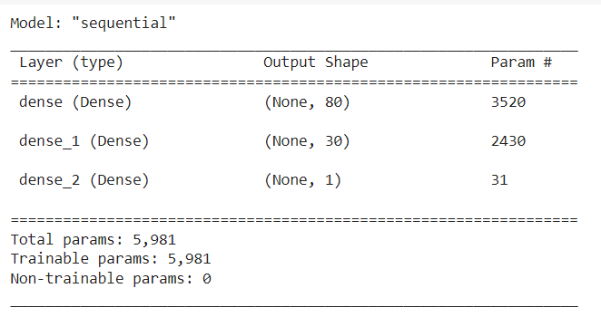

***Table 5 - Initial Neural Network Model Summary***

The results are very poor with the highest losses of all of our attempts.  The accuracy was also quite low.

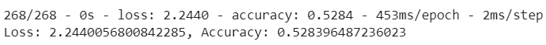

***Table 6 - Initial Neural Network Performance***

#### 2.2.2 Attempt #1 - More Nodes and Layers

Based on the large number of features we first decided to increase the first layer nodes to twice the number of features, make the second layer half the first and add a 3rd layer, that was half that again.

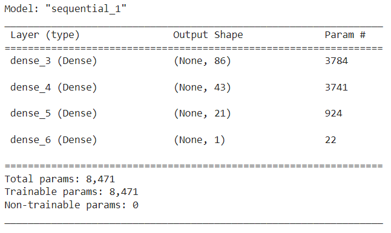

***Table 7 - More Nodes & Layers Neural Network Model Summary***

The model was way less lossy but the accuracy was about the same as the initial try.

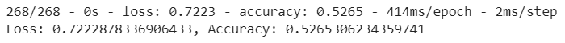

***Table 8 - More Nodes & Layers Neural Network Performance***

#### 2.2.3 Attempt #2 - Remove Noisy Variables

Not having success with more layers and nodes, we tried simply removing features that seem to add little value so we dropped all the AFFILIATION_ features as can be seen in Table 9.

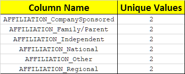

***Table 9 - Affiliation Columns Dropped***

The rest of the model is the same as what we originally received, as we were trying to trace performance improvement measures.

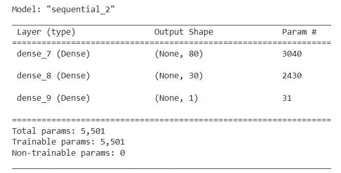

***Table 10 - Remove Affiliation Neural Network Model Summary***

This model did again make an improvement in loss and accuracy, but still a pretty bad fit.

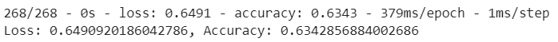

***Table 11 - Remove Affiliation Neural Network Model Performance***

#### 2.2.4 Attempt #3 - Change Activation Function

Returning again to the original setup we then changed the activation layers from Relu to Sigmoid to see what, if any difference, that may make.

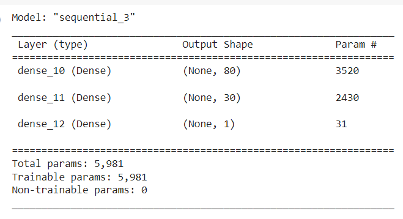

***Table 12 - Change Activation Neural Network Model Summary***

Interestingly, the results where very close to that of the more nodes and layer model - and still not very good.

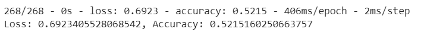

***Table 13 - Change Activation Neural Network Model Performance***

#### 2.2.5 Attempt #4 - Remove Different Noisy Variables

In a final attempt to see if we could improve performance we looked at the features again and decided that the Ask Amount (ASK_AMT) shouldn't have a big impact on success, but being all over the map may make a big difference on how the model performs.

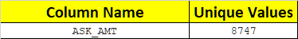

***Table 14 - Ask Amount Column Dropped***

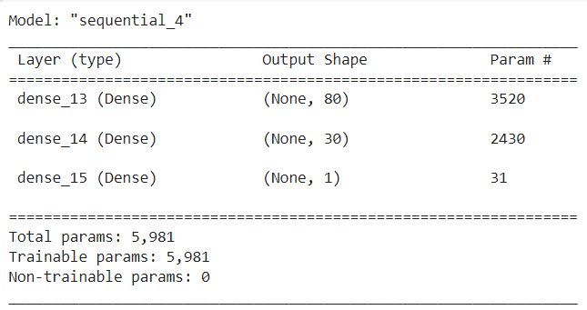

***Table 15 - Remove Ask Network Model Summary***

Based on the Loss value of 0.11 and the Accuracy of 1.00, in Table 16, I am happy to report that we have been successful.

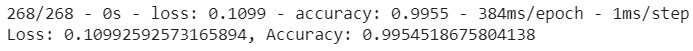

***Table 16 - Remove Ask Network Model Performance***

## **Summary:** 

Table 17 below has be sorted by lowest to highest loss value.  You will notice that the two best performers involved removing noisy data.  The removal of Ask Amount was far superior to the removal of Affiliation providing a very good predictor of success.  I would conclude by saying it is very important for someone with domain expertise to be involved in the selection of what data to use as input to the model.

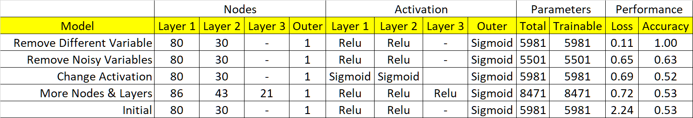

***Table 17 - Summary of Results***